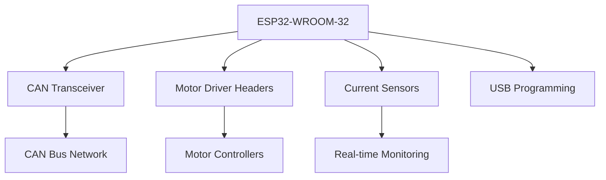

# ESP32 Custom Board Development


## Overview
This directory will contain all files related to custom ESP32 development board designs optimized for robotic applications.

## 🎯 Design Concept



## 🖼️ Design Vision

<div align="center">

### Conceptual Block Diagram
```
┌─────────────────────────────────────────────────┐
│                ESP32 Custom Board               │
├─────────────────────────────────────────────────┤
│  ┌─────────┐  ┌──────────┐  ┌───────────────┐   │
│  │ ESP32   │  │ CAN      │  │ Motor Driver  │   │
│  │ WROOM   │  │ SN65HVD  │  │ Headers       │   │
│  │ -32     │  │ 230      │  │               │   │
│  └─────────┘  └──────────┘  └───────────────┘   │
├─────────────────────────────────────────────────┤
│  ┌─────────┐  ┌──────────┐  ┌───────────────┐   │
│  │ Current │  │ USB-C    │  │ Power         │   │
│  │ Sensors │  │ Program  │  │ Management    │   │
│  │ ACS37030│  │ Interface│  │               │   │
│  └─────────┘  └──────────┘  └───────────────┘   │
└─────────────────────────────────────────────────┘
```

</div>

## Project Goals
- Create a specialized ESP32 development board
- Integrate CAN bus communication
- Include motor driver interfaces
- Add current sensing capabilities
- Minimize external wiring requirements

## Target Features
- **MCU**: ESP32-WROOM-32 module
- **Communication**: Onboard CAN headers (SN65HVD230)
- **Motor Control**: Integrated motor driver headers
- **Sensing**: Built-in current sensor provisions
- **Connectivity**: USB programming interface
- **Power**: Flexible power input options

## Development Status
🔄 **In Progress** - Design phase ongoing

## File Structure (Planned)
```
ESP32 Custom Boards/
├── Schematics/
├── PCB Layouts/
├── 3D Models/
├── Documentation/
└── Test Results/
```

## Design Considerations
1. **Compact Form Factor**: Optimize for space-constrained applications
2. **Robust Communication**: Reliable CAN bus implementation
3. **Flexible I/O**: Expandable GPIO options
4. **Easy Programming**: USB-C programming interface
5. **Cost Effective**: Balance features with cost

## Applications
- Rover control nodes
- Sensor data acquisition
- Motor control systems
- Wireless communication hubs
- Distributed control systems

---
*R&D Team - Team Deimos IIT Mandi*
