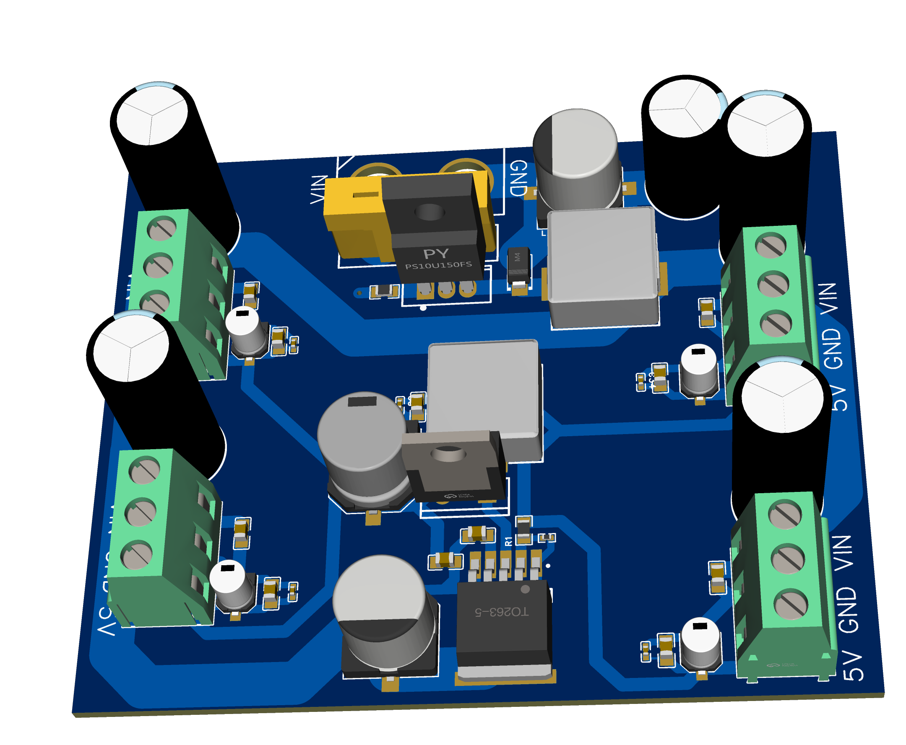
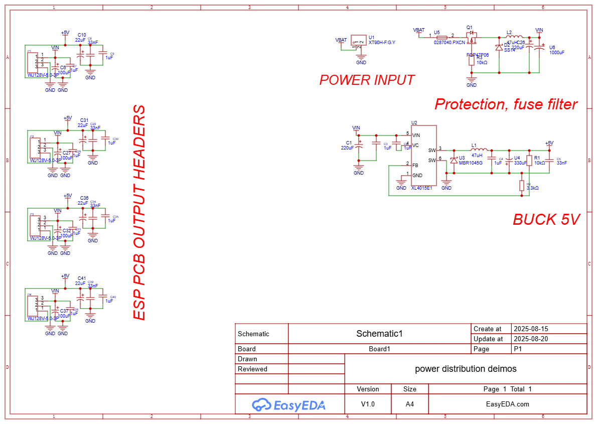

# Power Distribution PCB Files

## Overview
This directory contains all files related to the Power Distribution Network (PDN) PCB design.

## 🖼️ Design Visuals

### 3D PCB Visualization

*3D rendered view of the Power Distribution PCB showing component placement and routing*

### Schematic Diagram

*Complete schematic showing the 24V to 5V buck converter with protection circuits*

## Files Description

### Design Files
- `PCB_PCB1_2025-08-20.pdf` - Complete PCB layout documentation
- `SCH_Schematic1_1-P1_2025-08-20.png` - Schematic diagram
- `3D_PCB1_2025-08-20.png` - 3D visualization of the PCB

### Design Specifications
- **Input Voltage**: 24V DC
- **Output Voltage**: 5V DC
- **Current Rating**: Up to 60A (with 60A fuse protection)
- **Protection Features**: 
  - Reverse polarity protection
  - Surge protection
  - EMI filtering

### Key Components
- Buck converter (24V to 5V)
- Protection circuits
- Filter capacitors
- Current sensing provisions

### Status
✅ **Design Complete** - Ready for prototyping and testing

### Next Steps
1. Prototype assembly
2. Electrical testing and validation
3. Thermal testing under load
4. EMI/EMC compliance testing
5. Production preparation

---
*R&D Team - Team Deimos IIT Mandi*
