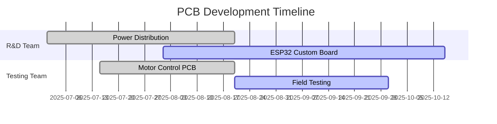

# PCB-Designs Repository

**Team Deimos - IIT Mandi**


This repository contains PCB designs for various robotic systems including drive systems, power distribution, robotic arm control, and miscellaneous components developed by Team Deimos.

## 🖼️ Featured Designs

<table>
<tr>
<td width="50%">

### Power Distribution Network

*24V to 5V Buck Converter with Protection*

### Integrated Drive PCB

*Integrated PCB for drive with CAN*

</td>
<td width="50%">

### Motor Control PCB

*Rover Motor Control with ESP32 & CAN*

</td>
</tr>
</table>

## 🚀 Overview

Our PCB designs are organized into specialized teams focusing on different aspects of robotic system development:

- **R&D Team**: Research and development of innovative PCB solutions
- **Testing Team**: Validation and testing of PCB designs in real-world scenarios

## 📁 Repository Structure

```
PCB-Designs/
├── R&D Team PCB Designs/          # R&D team developments
│   ├── Power Distribution/        # PDN and power management
│   ├── ESP32 Custom Boards/       # Custom ESP32 developments
│   └── Documentation/             # Design docs and specifications
├── Testing Team PCB Designs/      # Testing and validation
│   ├── Motor Control/             # Motor driver PCBs
│   ├── BOM Files/                 # Bill of Materials
│   └── Test Results/              # Testing documentation
└── Documentation/                 # Shared documentation
```

## 🔧 Current Projects

### R&D Team Projects


- **Power Distribution Network (PDN)**: 24V to 5V buck converter with surge protection
- **Custom ESP32 Board**: Development board with CAN headers and motor driver integration

### Testing Team Projects


- **Rover Motor Control**: PCB for rover motor control systems
- **Component Testing**: Validation of motor drivers and sensors

## 📊 Quick Stats


- **Active Teams**: 2 (R&D & Testing)
- **Current PCB Designs**: 4+
- **Latest Update**: August 2025

### 🚀 Project Status Overview



## 🛠️ Design Tools

- **PCB Design**: KiCad, Altium Designer
- **3D Modeling**: Integrated PCB 3D viewers
- **Documentation**: Markdown, PDF exports

## 📋 Getting Started

1. Navigate to the appropriate team folder
2. Review the team-specific README files
3. Check the latest design files and documentation
4. Follow the design guidelines in each team's folder

## 🤝 Contributing

1. Fork the repository
2. Create a feature branch for your PCB design
3. Document your design thoroughly
4. Submit a pull request with detailed description

## 📞 Contact

For questions about specific designs, please refer to the team-specific README files or contact the respective team leads.

---

<div align="center">

### 🏆 Team Deimos - IIT Mandi


**Building the Future of Robotics, One PCB at a Time**

[](https://github.com/Team-Deimos-IIT-Mandi/PCB-Designs)
[](https://github.com/Team-Deimos-IIT-Mandi)
[](https://github.com/Team-Deimos-IIT-Mandi/PCB-Designs)

*Last Updated: September 2025*

</div>
