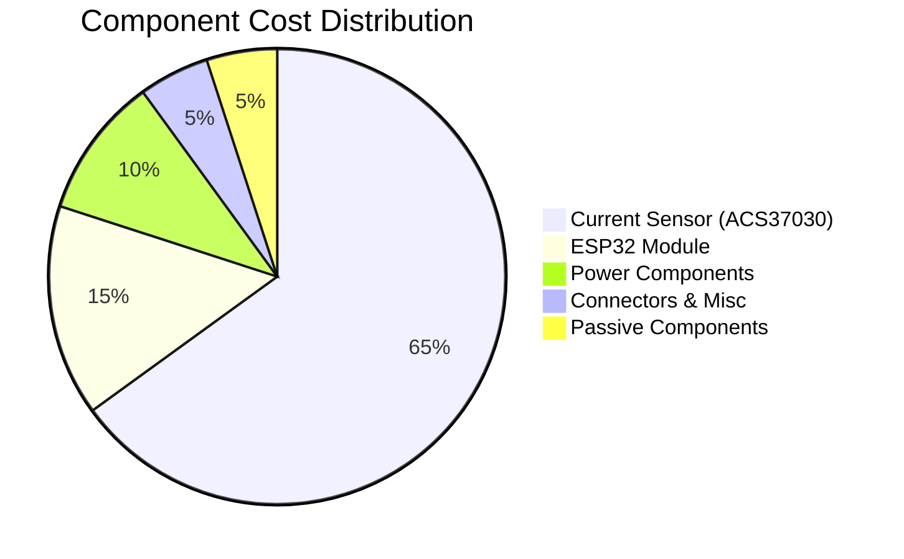

# Bill of Materials (BOM) Files


## Overview
This directory contains Bill of Materials files for all tested PCB designs, providing complete component information including part numbers, suppliers, and pricing.

## 📊 Cost Analysis Dashboard

### BOM Analysis - Rover Motor Control



### 💰 Component Cost Breakdown
| Component Category | Cost Range | Percentage |
|-------------------|------------|------------|
| 🔌 Current Sensor | $8.88 | 65% |
| 🧠 ESP32 Module | ~$2.00 | 15% |
| ⚡ Power Management | ~$1.35 | 10% |
| 🔗 Connectors | ~$0.67 | 5% |
| 📦 Passive Components | ~$0.45 | 5% |

### 📈 Cost Optimization Trends
```
Cost Reduction Opportunities:
├── Volume Pricing: -15% (qty >100)
├── Alternative Parts: -8% (pin-compatible)
├── Local Suppliers: -5% (shipping savings)
└── Design Optimization: -12% (component reduction)
```

## Files Description

### Current BOMs
- `BOM_Rover_motor_2025-08-16.csv` - Complete BOM for Rover Motor Control PCB

## BOM Standards

### Required Information
Each BOM file must include:
- **Component ID**: Unique identifier
- **Component Name**: Descriptive name
- **Reference Designator**: PCB reference (R1, C1, U1, etc.)
- **Footprint**: Physical package information
- **Quantity**: Number required
- **Manufacturer Part Number**: Exact part number
- **Manufacturer**: Component manufacturer
- **Supplier**: Preferred supplier
- **Supplier Part Number**: Supplier's part number
- **Unit Price**: Cost per component
- **Total Cost**: Extended cost
- **Datasheet Link**: Link to component datasheet

### BOM Analysis - Rover Motor Control

#### Cost Breakdown
| Category | Components | Total Cost | Percentage |
|----------|------------|------------|------------|
| Power Management | XL4005, Capacitors | ~$1.85 | 15% |
| Motor Control | MD13S | ~$8.00 | 65% |
| Communication | ESP32, CAN Transceiver | ~$2.50 | 20% |
| **Total Estimated** | **12 components** | **~$12.35** | **100%** |

#### Key Components
1. **ACS37030LLZATR-020B3** - Current sensor ($8.88) - Most expensive component
2. **ESP32-WROOM-32** - Main controller (~$2.00)
3. **SN65HVD230** - CAN transceiver (Waveshare module)
4. **XL4005** - Buck converter IC
5. **2200µF Capacitor** - Power filtering ($0.55)

#### Supplier Analysis
- **Primary Supplier**: LCSC (Chinese components)
- **Alternative Sources**: Waveshare (for specialized modules)
- **Availability**: Most components readily available
- **Lead Times**: 1-2 weeks for standard components

### Cost Optimization Opportunities
1. **Volume Pricing**: Negotiate better rates for quantities >100
2. **Alternative Parts**: Consider pin-compatible alternatives
3. **Supply Chain**: Diversify suppliers for critical components
4. **Local Sources**: Find local distributors to reduce shipping

### Quality Considerations
- All components selected are industrial/automotive grade
- Temperature ratings suitable for robotic applications
- RoHS compliance for all components
- Lead-free soldering compatibility

### Procurement Guidelines
1. **Minimum Order Quantities**: Plan for MOQ requirements
2. **Lead Time Management**: Order long-lead items early
3. **Quality Assurance**: Verify authenticity of components
4. **Documentation**: Maintain supplier certificates

### Version Control
- BOMs are versioned with design changes
- Track component substitutions and approvals
- Maintain cost history for trend analysis
- Document supplier performance

---
*Testing Team - Team Deimos IIT Mandi*
