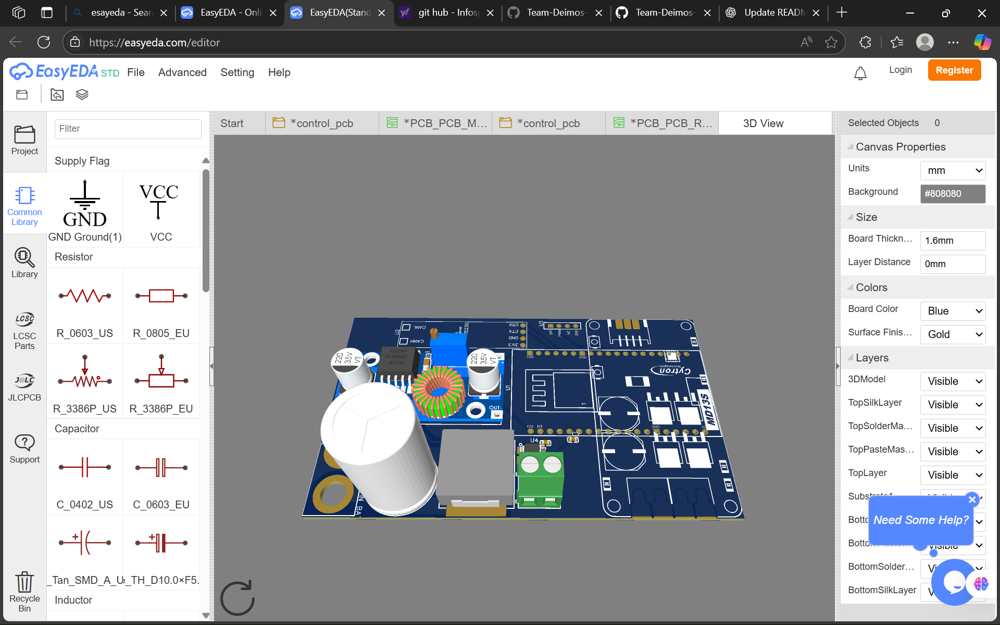

# Motor Control PCB Files

## Overview
This directory contains all design files for the Rover Motor Control PCB, including schematics, layouts, and related documentation.

## 🖼️ PCB Visualization

### 3D Rendered View

*3D visualization showing the complete assembled PCB with all components*

### Design Highlights
<table>
<tr>
<td width="50%">

**Key Features:**
- ⚡ High-current motor control (MD13S)
- 🧠 ESP32-WROOM-32 brain
- 📡 CAN bus communication
- 📊 Real-time current sensing
- 🔌 22.2V power input

</td>
<td width="50%">

**Performance Metrics:**
- ⏱️ Response Time: < 50ms
- 🎯 Accuracy: ±2%
- 📶 Communication: < 10ms latency
- ⚡ Efficiency: > 90%

</td>
</tr>
</table>

## Files Description

### Design Files
- `PCB_PCB_Rover_motor_2_2025-08-20.pdf` - Complete PCB layout with dimensions
- `SCH_Rover_motor_2025-08-16.json` - Schematic in JSON format
- `PCB_PCB_PCB_Rover_motor_2_2025-08-16.json` - PCB design data
- `PCB_3D_view.png` - 3D visualization of assembled PCB

### Technical Specifications
- **Motor Driver**: MD13S (high-current capability)
- **Microcontroller**: ESP32-WROOM-32 (38-pin)
- **Power Input**: 22.2V via XT90 connector
- **Current Sensing**: ACS37030LLZATR-020B3 (±20A range)
- **Communication**: CAN bus via SN65HVD230
- **Power Regulation**: XL4005 step-down converter

### Key Features
1. **High-Current Motor Control**: Capable of driving high-power motors
2. **Integrated Sensing**: Real-time current monitoring
3. **Wireless Communication**: ESP32 with WiFi/Bluetooth
4. **CAN Bus**: Reliable inter-module communication
5. **Robust Power Supply**: Regulated power for all subsystems

### Testing Status
- ✅ **Design Review**: Completed
- ✅ **DRC/ERC**: No violations
- 🔄 **Prototype Testing**: In progress
- ⏳ **Field Testing**: Pending

### Performance Metrics
- **Motor Response Time**: < 50ms
- **Current Measurement Accuracy**: ±2%
- **Communication Latency**: < 10ms  
- **Power Efficiency**: > 90%

### Known Issues
1. **Thermal Management**: Some components run warm under full load
2. **Component Placement**: Layout could be optimized for better thermal distribution

### Recommended Improvements
1. Larger ground plane for heat dissipation
2. Additional TVS diodes for ESD protection
3. Optimized component placement for thermal management

---
*Testing Team - Team Deimos IIT Mandi*
